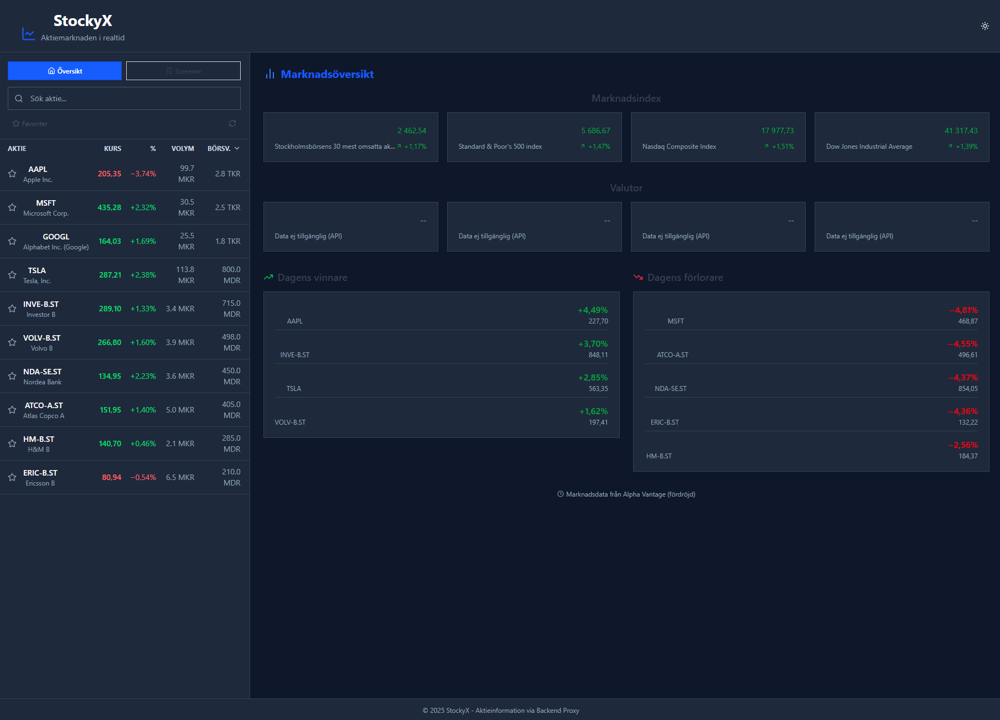

# StockyX 📈

A modern stock market analytics platform for monitoring, analyzing, and tracking stock prices in real-time.



## 🌟 Features

- **Market Overview** - Get a quick snapshot of market indices, currencies, and daily top movers
- **Stock Search & Filtering** - Search and filter stocks with real-time price updates
- **Advanced Charting** - Visualize historical data with interactive price charts
- **Detailed Stock Information** - Access company information, financial metrics, and news
- **Favorites Management** - Save and follow your favorite stocks for quick access
- **Responsive Design** - Works seamlessly on desktop, tablet, and mobile devices
- **Dark Mode Support** - Comfortable visual experience in all lighting conditions

## 🚀 Getting Started

### Prerequisites

- Node.js (version 18 or later)
- npm or yarn
- API keys for Alpha Vantage and NewsAPI

### Installation

1. Clone the repository
   ```bash
   git clone https://github.com/yourusername/StockyX.git
   cd StockyX
   ```

2. Install frontend dependencies
   ```bash
   npm install
   ```

3. Install backend dependencies
   ```bash
   cd server
   npm install
   cd ..
   ```

4. Configure API keys
   ```bash
   # Copy the example configuration file
   cp server/.env.example server/.env
   
   # Edit .env file and add your API keys
   # ALPHA_VANTAGE_API_KEY=your_alpha_vantage_key
   # NEWS_API_KEY=your_news_api_key
   ```

5. Start the backend development server
   ```bash
   cd server
   npm run dev
   ```

6. Start the frontend development server (in another terminal window)
   ```bash
   npm run dev
   ```

7. Open the application in your browser: [http://localhost:5173](http://localhost:5173)

## 🛠️ Technologies

### Frontend
- React 18
- Vite for fast builds
- Tailwind CSS for styling
- Lucide Icons for consistent UI elements
- Recharts for interactive data visualization
- Axios for API communication

### Backend
- Node.js
- Express for routing
- Yahoo Finance API for market data
- Alpha Vantage API for financial information
- NewsAPI for current stock-related news

## 📊 API Information

StockyX leverages the following APIs:

- **Alpha Vantage** - For stock data, company information, and currency exchange rates
- **NewsAPI** - For stock and company-related news
- **Yahoo Finance** (as fallback) - For additional stock data

API calls are handled through a custom backend proxy to protect API keys and implement efficient caching.

### Available Endpoints

- `/api/quote/:ticker` - Retrieves the latest stock quote
- `/api/history/:ticker` - Fetches historical price data
- `/api/overview/:ticker` - Gets company information and financial metrics
- `/api/news?q=searchterm` - Retrieves news based on search term
- `/api/currency/:fromCurrency/:toCurrency` - Fetches currency exchange rates
- `/api/topmovers` - Gets daily winners and losers

## 🧩 Project Structure

```
StockyX/
├── public/             # Static files
├── server/             # Backend proxy server
│   ├── server.js       # Express server implementation
│   └── ...
├── src/                # Frontend source code
│   ├── assets/         # Images and static assets
│   ├── components/     # React components
│   ├── services/       # API service functions
│   ├── App.jsx         # Main app component
│   └── ...
└── ...
```

## 🔧 Development

### Key Features Under Development

- **Portfolio Tracking** - Create and monitor custom stock portfolios
- **Notifications** - Get alerts for price movements and news
- **Advanced Filters** - Screen stocks based on technical and fundamental indicators
- **Performance Metrics** - Track and analyze investment performance

### Performance Optimizations

- Efficient data caching to minimize API calls
- Lazy loading of components for faster initial load
- Debounced search to prevent API rate limiting

## 🤝 Contributing

We welcome contributions to StockyX! Here's how you can help:

1. Fork the repository
2. Create a feature branch (`git checkout -b feature/amazing-feature`)
3. Commit your changes (`git commit -m 'Add some amazing feature'`)
4. Push to the branch (`git push origin feature/amazing-feature`)
5. Open a Pull Request

Please ensure your code follows our style guidelines and includes appropriate tests.

## 📝 License

Distributed under the MIT License. See `LICENSE` file for more information.

## 📞 Contact

Project Link: [https://github.com/yourusername/StockyX](https://github.com/yourusername/StockyX)

---

Built with ❤️ in Sweden
